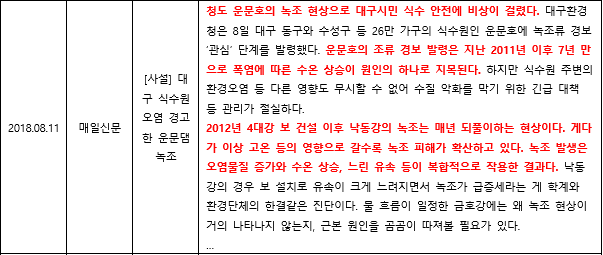

# 텍스트 데이터 기반 기상 피해 문장 추출

- 학부 졸업 프로젝트로 기사 별 피해 문장을 추출하고자 하며, 이를 통해 영향 예보에 필요한 피해 현황 정보를 수집하는 것을 목표로 한다. 
- 여러 데이터 마이닝 기법을 사용하여 최적의 분류 모델을 생성한 뒤 실제 데이터에 적용해 정성적인 평가를 진행하였다.

<p align="center"></p>


## 시작하기

### 선행 설치 조건

python 3.6 이상

```
numpy >=1.16.0
pandas >=0.24.2
sklearn >=0.20.1
gensim >=3.8.0
konlpy >=0.5.1
keras >=2.2.5
xgboost >=0.82
mlxtend >=0.17.0
```
### 데이터

(프로젝트에 필요한 전체 데이터는 보안상 업로드가 불가하여 직접 크롤링 및 라벨링한 데이터(damage1100.csv)만 업로드)

문장을 이진 분류(0/1) 레이블링 함.
||문장|T/F|
|------|---|---|
|1|산사태와 축대 붕괴 침수 피해 등에 철저히 대비해 주시기 바랍니다.|0|
|2|천만다행으로 지나던 사람이 없어 인명피해는 없었습니다.|0|
|3|최근 찜통 더위가 연일 이어진 가운데 전 남지역에서 가축과 양식 어류 폐사가 속출하고 있습니다.|1|
|4|중국 남동부 일대에 연일 불볕 더위가 이어지면서 열사병으로 20여 명이 숨진 것으로 파악됐습니다.|1|

## 파일 설명
#### 1) preprocessing.ipynb \& preprocessing_Ensemble.ipynb

    빈 텍스트 제거, Stop word 제거, 품사 태깅

#### 2) Sentence_classification.ipynb

    벡터화(Word2Vec, Doc2Vec, Fasttext) 및 분류 모델(LSTM, 1D-CNN, XGBoost) 생성

#### 3) sentence_utility.py

    1), 2)에 필요한 함수 구현

#### 4) Associative_classification(TBM).ipynb

    연관 분류 모델('Associative classification based on the Transferable Belief Model') 생성 

#### 5) Predict.ipynb

    생성된 모델들을 통해 적용 및 성능 평가

## 기여자

* [양동욱](dongwook412@naver.com)
* [황보성훈](thehb01@gmail.com)
